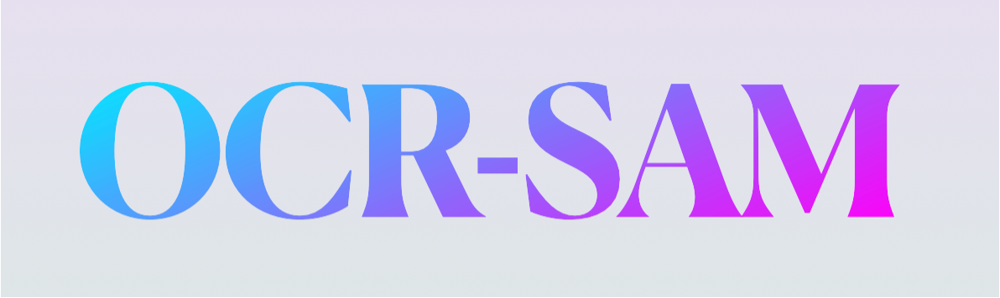

# 🖼️ **OCR-SAM: Packaging Information Extraction** 📦



This repository is an extension of the original [OCR-SAM project](https://github.com/yeungchenwa/OCR-SAM), designed to extract key packaging information such as:

-   **Product Name**
-   **Brand**
-   **Manufacturing Date**
-   **Expiration Date**
-   **Weight**

Using a combination of **OCR** and **SAM**, it simplifies text detection and recognition for packaging, with a focus on **Vietnamese datasets**.

---

## 📸 **Overview** 🔥

OCR-SAM integrates:

-   🌟 **[SAM (Segment Anything Model)](https://github.com/facebookresearch/segment-anything)**: A cutting-edge model for segmentation.
-   📖 **[MMOCR](https://github.com/open-mmlab/mmocr)**: A versatile OCR library for text recognition.

This repository improves on the original by:

1. **Optimizing for packaging information** with a streamlined focus.
2. Providing accurate **text detection and recognition** for essential fields:
    - Product Name, Brand, Dates, and Weight.

---

## 🚀 **Installation** 🛠️

### Prerequisites 📋

-   Python 3.8+
-   PyTorch 1.12+
-   CUDA 11.3+
-   Linux or Windows OS.

### Step-by-step Setup 🧰

1️⃣ **Clone the repository**:

```bash
git clone https://github.com/htrnguyen/OCR-SAM
cd OCR-SAM
```

2️⃣ **Create a virtual environment**:

```bash
conda create -n ocr-sam python=3.10 -y
conda activate ocr-sam
```

3️⃣ **Install dependencies**:

```bash
pip install -r requirements.txt
```

---

## 📒 **Model Checkpoints** 🖥️

To use OCR-SAM, download the required checkpoints for all components. Follow the instructions below:

### **Step 1: Create a directory for checkpoints**

```bash
mkdir checkpoints
mkdir checkpoints/mmocr
mkdir checkpoints/sam
mkdir checkpoints/ldm
```

### **Step 2: Download the checkpoints**

1. 🟢 **DBNet++ with Swin Transformer V2** (Scene Text Detection):  
   [Download here (Google Drive)](https://drive.google.com/file/d/1r3B1xhkyKYcQ9SR7o9hw9zhNJinRiHD-/view)  
   Move it to `checkpoints/mmocr`:

    ```bash
    mv db_swin_mix_pretrain.pth checkpoints/mmocr
    ```

2. 🔵 **MMOCR Recognizer Checkpoint (ABINet)**:

    ```bash
    wget -O checkpoints/mmocr/abinet_20e_st-an_mj_20221005_012617-ead8c139.pth https://download.openmmlab.com/mmocr/textrecog/abinet/abinet_20e_st-an_mj/abinet_20e_st-an_mj_20221005_012617-ead8c139.pth
    ```

3. 🟡 **SAM Checkpoint** (ViT-H):  
   [More details here.](https://github.com/facebookresearch/segment-anything#model-checkpoints)

    ```bash
    wget -O checkpoints/sam/sam_vit_h_4b8939.pth https://dl.fbaipublicfiles.com/segment_anything/sam_vit_h_4b8939.pth
    ```

4. 🟠 **Latent Diffusion Model Checkpoint** _(Optional)_:
    ```bash
    wget -O checkpoints/ldm/last.ckpt https://heibox.uni-heidelberg.de/f/4d9ac7ea40c64582b7c9/?dl=1
    ```

---

## 🏃‍♂️ **Usage** 💻

### **Run the Application** 🖼️

Extract packaging information from an image:

```bash
python app.py --inputs /path/to/image.jpg --output_dir /path/to/output --device cuda
```

-   **`--inputs`**: Path to the input image.
-   **`--output_dir`**: Directory where results (text and annotated images) will be saved.
-   **`--device`**: Run on `cuda` (GPU) or `cpu`.

---

### **Run Notebook** 📓

For an interactive demo, use `run.ipynb`:

```bash
jupyter notebook run.ipynb
```

---

### **Output** 📤

The application outputs:

1. **Recognized Text Fields**: Saved in JSON format.
2. **Annotated Images**: Text regions highlighted with bounding boxes.

---

## 🏗️ **Repository Structure** 📂

```plaintext
OCR-SAM/
├── app.py                 # Main application script
├── data/                  # Input images
├── docs/                  # Documentation
├── imgs/                  # Example images
├── mmocr_dev/             # Custom MMOCR configurations
├── mmocr_sam.py           # OCR-SAM integration script
├── requirements.txt       # Python dependencies
├── run.ipynb              # Interactive demo
├── run.py                 # Batch processing script
├── train.ipynb            # Fine-tuning notebook
├── checkpoints/           # Model checkpoints directory
└── OUTPUT/                # Results directory
```

---

## 📚 **References** 🔗

-   **Original OCR-SAM**: [https://github.com/yeungchenwa/OCR-SAM](https://github.com/yeungchenwa/OCR-SAM)
-   **SAM (Segment Anything Model)**: [https://github.com/facebookresearch/segment-anything](https://github.com/facebookresearch/segment-anything)
-   **MMOCR**: [https://github.com/open-mmlab/mmocr](https://github.com/open-mmlab/mmocr)

---

## ❤️ **Acknowledgments** 🙌

This project builds upon the incredible work of:

-   🧠 [Facebook AI](https://github.com/facebookresearch/segment-anything) for SAM.
-   📖 [OpenMMLab](https://github.com/open-mmlab/mmocr) for MMOCR.
-   🌟 [OCR-SAM](https://github.com/htrnguyen/OCR-SAM) for the original integration.
